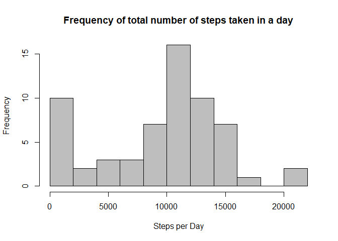
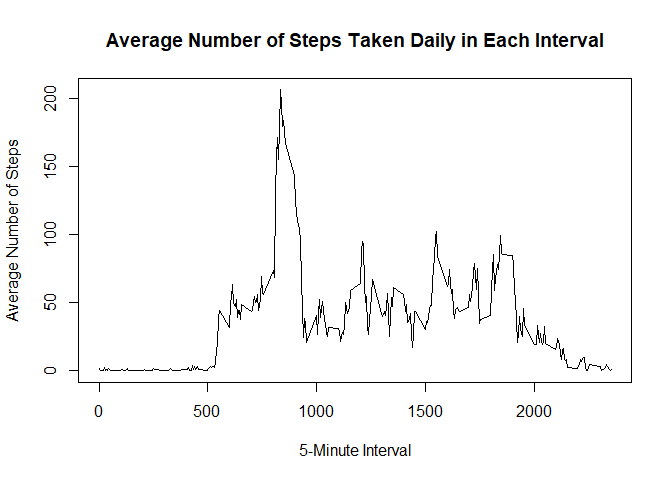
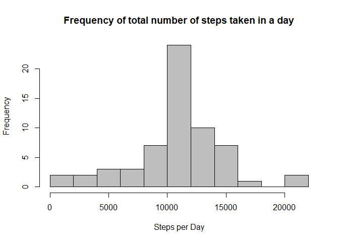
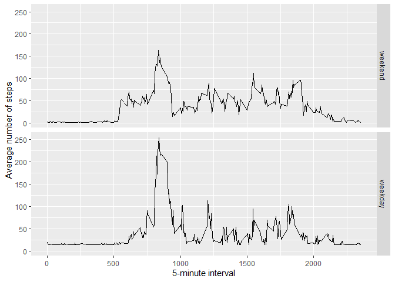

## Loading and preprocessing the data

The data are loaded from a csv file in the working directory called "activity.csv"


```r
activity.data <- read.csv("activity.csv")
```

## What is the mean total number of steps taken per day?

*(For this part of the assignment, I am ignoring missing values)*

1. Calculate the total number of steps taken per day

To calculate the steps taken per day, we need to first calculate the daily number of steps.


```r
StepsPerDay <- tapply(activity.data$steps, activity.data$date, sum, na.rm = TRUE)
```
To present the data in table format I will use the 'kable' function in the 'knitr' package.


```r
library(knitr)
kable(StepsPerDay, caption = "Steps taken per day", col.names ="Steps")
```


Table: Steps taken per day

              Steps
-----------  ------
10/1/2012         0
10/10/2012     9900
10/11/2012    10304
10/12/2012    17382
10/13/2012    12426
10/14/2012    15098
10/15/2012    10139
10/16/2012    15084
10/17/2012    13452
10/18/2012    10056
10/19/2012    11829
10/2/2012       126
10/20/2012    10395
10/21/2012     8821
10/22/2012    13460
10/23/2012     8918
10/24/2012     8355
10/25/2012     2492
10/26/2012     6778
10/27/2012    10119
10/28/2012    11458
10/29/2012     5018
10/3/2012     11352
10/30/2012     9819
10/31/2012    15414
10/4/2012     12116
10/5/2012     13294
10/6/2012     15420
10/7/2012     11015
10/8/2012         0
10/9/2012     12811
11/1/2012         0
11/10/2012        0
11/11/2012    12608
11/12/2012    10765
11/13/2012     7336
11/14/2012        0
11/15/2012       41
11/16/2012     5441
11/17/2012    14339
11/18/2012    15110
11/19/2012     8841
11/2/2012     10600
11/20/2012     4472
11/21/2012    12787
11/22/2012    20427
11/23/2012    21194
11/24/2012    14478
11/25/2012    11834
11/26/2012    11162
11/27/2012    13646
11/28/2012    10183
11/29/2012     7047
11/3/2012     10571
11/30/2012        0
11/4/2012         0
11/5/2012     10439
11/6/2012      8334
11/7/2012     12883
11/8/2012      3219
11/9/2012         0

2. Make a histogram of the total number of steps taken each day


```r
hist(StepsPerDay, col = "gray", xlab = "Steps per Day", breaks = 15, main = paste("Frequency of" , "total number of steps taken in a day")) 
```

<!-- -->

3. Calculate and report the mean and median of the total number of steps taken per day


```r
Mean <- format(mean(StepsPerDay), nsmall = 2)
Median <- format(median(StepsPerDay), nsmall = 2)
```

The **mean** number of steps taken per day is **9354.23** and the **median** number of steps taken per day is **10395**.


## What is the average daily activity pattern?

1. Make a time series plot (type="l") of the 5-minute interval (x-axis) and the average number of steps taken, averaged across all days (y-axis)


```r
AverageStepsPerInterval <- aggregate(x = list(AverageSteps = activity.data$steps), by = list(Interval = activity.data$interval), FUN=mean, na.rm = TRUE)
 plot(AverageStepsPerInterval, type = "l", main = "Average Number of Steps Taken Daily in Each Interval", xlab = "5-Minute Interval", ylab = "Average Number of Steps")
```

<!-- -->

2. Which 5-minute interval, on average across all the days in the dataset, contains the maximum number of steps?


```r
max.steps <- AverageStepsPerInterval[which.max(AverageStepsPerInterval$AverageSteps),1]
```

The interval 835 has the maximum average number of steps.

## Imputing missing values

1. Calculate and report the total number of missing values in the dataset (i.e. the total number of rows with NAs)


```r
Total.NA <- sum(sapply(activity.data, is.na))
```

The total number of missing values is 2304.

2. Devise a strategy for filling in all of the missing values in the dataset. The strategy does not need to be sophisticated. For example, you could use the mean/median for that day, or the mean for that 5-minute interval, etc.

*I will be filling the missing (NA) values with the mean for the steps in that interval.*

3. Create a new dataset that is equal to the original dataset but with the missing data filled in.


```r
filled.in.steps <- activity.data$steps
filled.in.steps[is.na(filled.in.steps)] <- round(mean(activity.data$steps, na.rm = TRUE))
filled.in.steps <- as.numeric(filled.in.steps)
New.activity.data <- cbind.data.frame(filled.in.steps, activity.data$date, activity.data$interval)
colnames(New.activity.data) <- colnames (activity.data)
```
4. Make a histogram of the total number of steps taken each day and Calculate and report the mean and median total number of steps taken per day. Do these values differ from the estimates from the first part of the assignment? What is the impact of imputing missing data on the estimates of the total daily number of steps?

```r
New.StepsPerDay <- tapply(New.activity.data$steps, New.activity.data$date, sum, na.rm = TRUE)

hist(New.StepsPerDay, col = "gray", xlab = "Steps per Day", breaks = 15, main = paste("Frequency of" , "total number of steps taken in a day")) 
```

<!-- -->

```r
Mean <- format(mean(New.StepsPerDay), nsmall = 2)
Median <- format(median(New.StepsPerDay), nsmall = 2)
```

Using the "complete" dataset, the **mean** number of steps taken per day is **10751.74** and the **median** number of steps taken per day is **10656.00**.

These values differ from the ones obtained in the first part of the assignment, where NA values where ignored. The impact of imputing missing data on the estimates of the total daily number of steps was not very significant. The mean and median values are both slightly higher in the imputed data.


## Are there differences in activity patterns between weekdays and weekends?

For this part the weekdays() function may be of some help here. Use the dataset with the filled-in missing values for this part.

1. Create a new factor variable in the dataset with two levels – “weekday” and “weekend” indicating whether a given date is a weekday or weekend day.


```r
New.activity.data$date <- as.Date(New.activity.data$date)
weekday <- c('Monday', 'Tuesday', 'Wednesday', 'Thursday', 'Friday')
New.activity.data$day <- factor((weekdays(New.activity.data$date) %in% weekday),
                                levels = c(FALSE, TRUE), labels = c('weekend','weekday'))
```

2. Make a panel plot containing a time series plot (i.e. type="l") of the 5-minute interval (x-axis) and the average number of steps taken, averaged across all weekday days or weekend days (y-axis). See the README file in the GitHub repository to see an example of what this plot should look like using simulated data.


```r
library(ggplot2)
Average.New.activity.data <- aggregate(steps ~ interval + day, data = New.activity.data, mean)
ggplot(Average.New.activity.data, aes(interval, steps)) + 
    geom_line() + 
    facet_grid(day ~ .) +
    xlab("5-minute interval") + 
    ylab("Average number of steps")
```

<!-- -->
